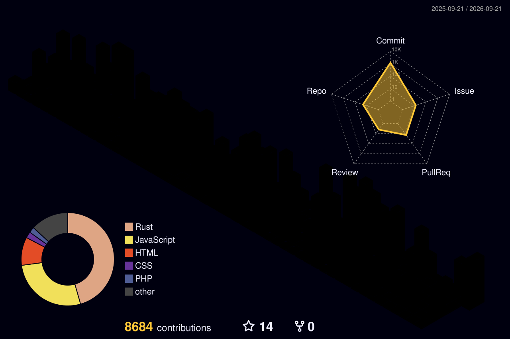

  

<h1 align="center">Hi there! I'm 𝓚𝓪𝓷𝓪𝓭𝓮</h1>

 

## language used

## Used OS/OSS

## Used Framework

## Used Software

## Used SNS

## Studying Lang & System

 

<!-- カード横並び：Streak + Top Languages（プライベート込み・日本語） -->

  
  

 

